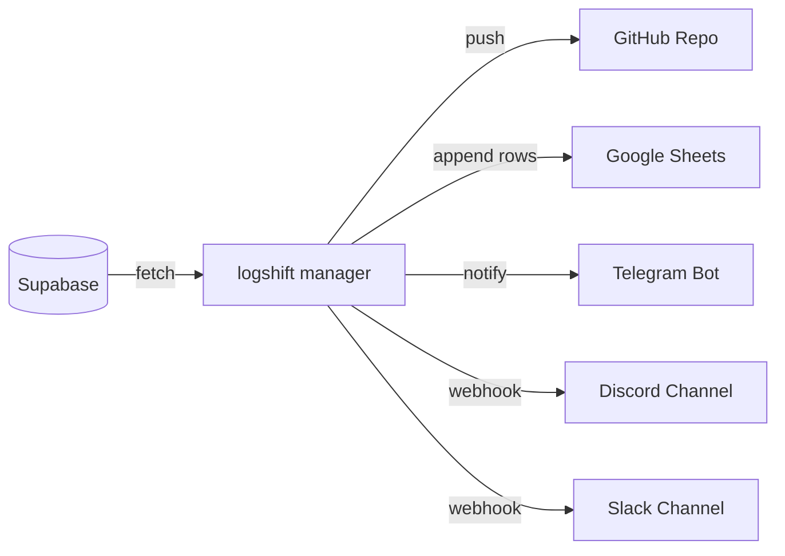

# logshift (formerly logport)

[](https://github.com/username/LogShifter/actions)
[](LICENSE)
[](#)

> Modular and scalable log archiving & transport SDK for Supabase and beyond.

---



---

## 1. About the Project

**logshift** is a developer-friendly Python SDK and Command Line Interface (CLI) built to extract log records from databases (such as Supabase) and ship/archive them asynchronously to multiple notification and storage destinations (GitHub, Google Sheets, Telegram, Discord, and Slack Webhooks). 

It is designed to solve database log retention limitations (e.g. Supabase Free Tier log retention limits) by automating scheduled archiving pipelines without losing critical debugging history.

---

## 2. Features

- **Strategy Pattern Architecture:** Each storage/notification channel is implemented as an independent `TransportAdapter`. You can easily add your own channels.
- **Unified Interface:** Register multiple adapters and ship logs concurrently using `asyncio`.
- **Cursor-Based Pagination:** Efficiently query millions of rows from Supabase using ID-based cursor pagination instead of heavy OFFSET calls.
- **Fail-Safe Retries:** Automatic network error resilience using exponential backoff retry loops.
- **No Global Env Files:** Designed to be clean and reusable—every configuration, key, and endpoint is passed strictly as explicit function arguments or CLI parameters.
- **Continuous Integration (CI):** Out-of-the-box workflows validating code formatting (black), style/lints (ruff), type checks (mypy), and compatibility testing matrix (pytest).
- **Discord & Slack Rate-Limit Handling:** Seamless HTTP 429 backoff retry loops using dynamic header configurations.
- **OpenTelemetry Standard Format:** Automatically maps raw database log rows into the standardized OpenTelemetry (OTLP) log record data structure (including `timestamp`, `severity_text`, `severity_number`, `body`, `attributes`, `trace_id`, and `span_id`), making logs instantly compatible with OTel collectors.
- **Dry-Run Mode:** Test your setup safely without modifying databases, committing code, or triggering active alerts.

---

## 3. Package Structure

```text
logshift/
├── .github/
│   └── workflows/
│       ├── ci.yml          # Continuous Integration workflow (Lint, Format, Test)
│       └── main.yml        # Logshift cron archiving workflow
├── src/
│   └── logshift/
│       ├── __init__.py
│       ├── core/           # Modularized Core Engines
│       │   ├── __init__.py
│       │   ├── adapter.py  # Abstract TransportAdapter base class
│       │   ├── exceptions.py # Structured Custom Exceptions
│       │   ├── fetcher.py  # Cursor-based Supabase LogFetcher
│       │   └── manager.py  # Orchestrating LogManager
│       └── adapters/       # Independent transport adapters
│           ├── __init__.py
│           ├── github.py   # GitPython based repository archiver
│           ├── sheets.py   # gspread based Google Sheets exporter
│           ├── telegram.py # httpx based Telegram notification channel
│           ├── discord.py  # httpx based Discord Webhook adapter
│           └── slack.py    # httpx based Slack Webhook adapter
├── demo/
│   └── demo.py         # Complete usage example
├── tests/              # Pytest unit tests
└── pyproject.toml      # Build metadata and tool setups
```

---

## 4. Installation

Clone the repository and install it in editable mode for local execution:

```bash
python3 -m venv .venv
source .venv/bin/activate
pip install -e .
```

### Requirements
- Python >= 3.9
- git binary (required by GitPython for repository operations)

---

## 5. CLI Usage

All configuration options are passed directly to subcommand targets. This keeps execution stateless and simple.

### Run in Dry-Run (Simulation) Mode
Test your configuration and see simulated logs output without pushing to Discord:
```bash
logshift --dry-run discord \
  --supabase-url "https://dummy.supabase.co" \
  --supabase-key "dummy-key" \
  --discord-webhook "https://discord.com/api/webhooks/123/abc"
```

### Run Active Archive Pipeline
Run the real pipeline pulling from Supabase and shipping to GitHub:
```bash
logshift github \
  --supabase-url "https://yourproject.supabase.co" \
  --supabase-key "your-supabase-service-role-key" \
  --supabase-table "logs" \
  --github-token "ghp_yourPersonalAccessToken" \
  --github-repo "username/logs-archive-repo"
```

---

## 6. Programmatic Usage

To run the SDK programmatically, instantiate the adapters by passing parameters explicitly to their constructors:

```python
import asyncio
from logshift.core import LogManager
from logshift.adapters.github import GitHubAdapter
from logshift.adapters.telegram import TelegramAdapter
from logshift.adapters.discord import DiscordAdapter
from logshift.adapters.slack import SlackAdapter

async def main():
    # Instantiate manager with retry logic (3 retries, initial delay 1.0s)
    manager = LogManager(dry_run=False, max_retries=3, initial_delay=1.0)
    
    # Register adapters explicitly passing parameters
    manager.register_adapter(GitHubAdapter(token="your_github_token"))
    manager.register_adapter(TelegramAdapter(bot_token="bot_token", chat_id="chat_id"))
    manager.register_adapter(DiscordAdapter(webhook_url="https://discord.com/api/webhooks/123/abc"))
    manager.register_adapter(SlackAdapter(webhook_url="https://hooks.slack.com/services/123/abc"))
    
    # Sample logs to archive
    logs = [{"id": 101, "level": "ERROR", "message": "CRITICAL: Service offline."}]
    targets = {
        "github": "myuser/my-logs-repo",
        "telegram": "chat_id",
        "discord": "https://discord.com/api/webhooks/123/abc",
        "slack": "https://hooks.slack.com/services/123/abc"
    }
    
    report = await manager.ship(logs=logs, targets=targets)
    print("Shipment report:", report)

if __name__ == "__main__":
    asyncio.run(main())
```

---

## 7. How to Write Your Own Adapter

Creating a custom transport adapter is straightforward. Simply inherit from the `TransportAdapter` abstract class and implement the `ship` method:

```python
from typing import Any, Dict, List
from logshift.core import TransportAdapter

class SlackAdapter(TransportAdapter):
    def __init__(self, webhook_url: str, name: str = "slack"):
        super().__init__(name)
        self.webhook_url = webhook_url

    async def ship(self, logs: List[Dict[str, Any]], target: str, **kwargs: Any) -> bool:
        dry_run = kwargs.get("dry_run", False)
        if dry_run:
            print(f"[Dry-Run Slack] Would post {len(logs)} logs to Slack webhook.")
            return True
            
        # Post logs to self.webhook_url asynchronously here
        return True
```

---

## 8. Automation (GitHub Actions Workflow)

Configure `.github/workflows/main.yml` using GitHub Secrets passed directly as execution parameters:

```yaml
name: Logshift Daily Cron

on:
  schedule:
    - cron: '0 0 * * *' # Daily at midnight UTC
  workflow_dispatch:

jobs:
  archive-logs:
    runs-on: ubuntu-latest
    steps:
      - uses: actions/checkout@v3
      - uses: actions/setup-python@v4
        with:
          python-version: '3.10'
      - name: Install dependencies
        run: |
          pip install -e .
      - name: Execute logshift
        run: |
          logshift archive \
            --supabase-url "${{ secrets.SUPABASE_URL }}" \
            --supabase-key "${{ secrets.SUPABASE_KEY }}" \
            --supabase-table "logs" \
            --dest github,slack \
            --github-token "${{ secrets.LOGSHIFT_GITHUB_TOKEN }}" \
            --github-repo "${{ secrets.LOGSHIFT_GITHUB_REPO }}" \
            --slack-webhook "${{ secrets.LOGSHIFT_SLACK_WEBHOOK }}"
```

---

## 9. Roadmap

- [ ] S3 Compatible Storage Adapter (MinIO, AWS S3, Cloudflare R2)
- [ ] Model Context Protocol (MCP) Server support (to connect directly with AI IDE agents)
- [x] Discord Webhook Adapter
- [x] Slack Notification Adapter

---

## 10. Contributing

We appreciate your interest in contributing to logshift!
- Please read [CONTRIBUTING.md](CONTRIBUTING.md) for details on submitting Pull Requests.
- For security issues, read [SECURITY.md](SECURITY.md) to report vulnerabilities privately.

---

## 11. License

This project is licensed under the Apache License 2.0. See [LICENSE](LICENSE) for details.
