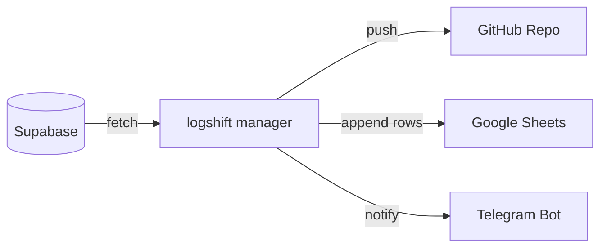

# logshift (formerly logport)

[](#)
[](LICENSE)
[](#)

> Modular and scalable log archiving & transport SDK for Supabase and beyond.

---



---

## 1. About the Project

**logshift** is a developer-friendly Python SDK and Command Line Interface (CLI) built to extract log records from databases (such as Supabase) and ship/archive them asynchronously to multiple notification and storage destinations (GitHub, Google Sheets, Telegram). 

It is designed to solve database log retention limitations (e.g. Supabase Free Tier log retention limits) by automating scheduled archiving pipelines without losing critical debugging history.

---

## 2. Features

- **Strategy Pattern Architecture:** Each storage/notification channel is implemented as an independent `TransportAdapter`. You can easily add your own channels.
- **Unified Interface:** Register multiple adapters and ship logs concurrently using `asyncio`.
- **Cursor-Based Pagination:** Efficiently query millions of rows from Supabase using ID-based cursor pagination instead of heavy OFFSET calls.
- **Fail-Safe Retries:** Automatic network error resilience using exponential backoff retry loops.
- **Pydantic Validation:** Strongly typed configuration loading and validation via `pydantic-settings`.
- **Dry-Run Mode:** Test your setup safely without modifying databases, committing code, or triggering active alerts.

---

## 3. Package Structure

```text
logshift/
├── src/
│   └── logshift/
│       ├── __init__.py
│       ├── config.py       # Pydantic Settings configuration loader
│       ├── core.py         # LogManager, LogFetcher, and base classes
│       └── adapters/       # Independent transport adapters
│           ├── __init__.py
│           ├── github.py   # GitPython based repository archiver
│           ├── sheets.py   # gspread based Google Sheets exporter
│           └── telegram.py # httpx based notification channel
├── demo/
│   └── demo.py         # Complete usage example
├── tests/              # Pytest unit tests
└── pyproject.toml      # Build metadata and tool setups
```

---

## 4. Installation

Clone the repository and install it in editable mode for local execution:

```bash
python3 -m venv .venv
source .venv/bin/activate
pip install -e .
```

### Requirements
- Python >= 3.9
- git binary (required by GitPython for repository operations)

---

## 5. Configuration

All configuration is loaded via environment variables or a local `.env` file managed by `pydantic-settings`. 

Configure your variables as shown in `.env.example`:

```env
# Supabase Source Configuration
SUPABASE_URL=https://your-project-id.supabase.co
SUPABASE_KEY=your-supabase-service-role-key
SUPABASE_TABLE_NAME=logs
SUPABASE_DATE_COLUMN=created_at

# GitHub Adapter Configuration
LOGSHIFT_GITHUB_TOKEN=ghp_yourGitHubAccessToken
LOGSHIFT_GITHUB_REPO=username/logs-archive-repo
LOGSHIFT_GITHUB_PATH=logs/archive.json
LOGSHIFT_GITHUB_BRANCH=main

# Google Sheets Configuration
GOOGLE_SERVICE_ACCOUNT_FILE=credentials.json
GOOGLE_SPREADSHEET_ID=your_spreadsheet_id_here
GOOGLE_WORKSHEET_NAME=Logs

# Telegram Configuration
TELEGRAM_BOT_TOKEN=your_bot_token_here
TELEGRAM_CHAT_ID=your_chat_id_here
```

---

## 6. Quick Start & CLI Usage

### Programmatic Usage

```python
import asyncio
from logshift.core import LogManager
from logshift.adapters.github import GitHubAdapter
from logshift.adapters.telegram import TelegramAdapter

async def main():
    # Instantiate manager with retry logic (3 retries, initial delay 1.0s)
    manager = LogManager(dry_run=False, max_retries=3, initial_delay=1.0)
    
    # Register adapters
    manager.register_adapter(GitHubAdapter(token="your_github_token"))
    manager.register_adapter(TelegramAdapter(bot_token="bot_token", chat_id="chat_id"))
    
    # Sample logs to archive
    logs = [{"id": 101, "level": "ERROR", "message": "CRITICAL: Service offline."}]
    targets = {
        "github": "myuser/my-logs-repo",
        "telegram": "chat_id"
    }
    
    report = await manager.ship(logs=logs, targets=targets)
    print("Shipment report:", report)

if __name__ == "__main__":
    asyncio.run(main())
```

### Command Line Interface (CLI)

Run dry-run simulation mode (safely logs what action would be taken without sending requests):
```bash
logshift --dry-run archive --source supabase --dest github,sheets,telegram
```

Run active archiving pipeline to specified destinations:
```bash
logshift archive --source supabase --dest github,telegram
```

---

## 7. How to Write Your Own Adapter

Creating a custom transport adapter is straightforward. Simply inherit from the `TransportAdapter` abstract class and implement the `ship` method:

```python
from typing import Any, Dict, List
from logshift.core import TransportAdapter

class SlackAdapter(TransportAdapter):
    def __init__(self, webhook_url: str, name: str = "slack"):
        super().__init__(name)
        self.webhook_url = webhook_url

    async def ship(self, logs: List[Dict[str, Any]], target: str, **kwargs: Any) -> bool:
        dry_run = kwargs.get("dry_run", False)
        if dry_run:
            print(f"[Dry-Run Slack] Would post {len(logs)} logs to Slack webhook.")
            return True
            
        # Post logs to self.webhook_url asynchronously here
        return True
```

---

## 8. Automation (GitHub Actions Workflow)

Create `.github/workflows/main.yml` to automate daily log archiving tasks:

```yaml
name: Logshift Daily Cron

on:
  schedule:
    - cron: '0 0 * * *' # Daily at midnight UTC
  workflow_dispatch:

jobs:
  archive-logs:
    runs-on: ubuntu-latest
    steps:
      - uses: actions/checkout@v3
      - uses: actions/setup-python@v4
        with:
          python-version: '3.10'
      - name: Install dependencies
        run: |
          pip install -e .
      - name: Execute logshift
        env:
          SUPABASE_URL: ${{ secrets.SUPABASE_URL }}
          SUPABASE_KEY: ${{ secrets.SUPABASE_KEY }}
          LOGSHIFT_GITHUB_TOKEN: ${{ secrets.LOGSHIFT_GITHUB_TOKEN }}
          LOGSHIFT_GITHUB_REPO: ${{ secrets.LOGSHIFT_GITHUB_REPO }}
        run: |
          logshift archive --source supabase --dest github
```

---

## 9. Roadmap

- [ ] S3 Compatible Storage Adapter (MinIO, AWS S3, Cloudflare R2)
- [ ] Model Context Protocol (MCP) Server support (to connect directly with AI IDE agents)
- [ ] Discord Webhook Adapter
- [ ] Slack Notification Adapter

---

## 10. Contributing

We appreciate your interest in contributing to logshift!
- Please read [CONTRIBUTING.md](CONTRIBUTING.md) for details on submitting Pull Requests.
- For security issues, read [SECURITY.md](SECURITY.md) to report vulnerabilities privately.

---

## 11. License

This project is licensed under the Apache License 2.0. See [LICENSE](LICENSE) for details.
