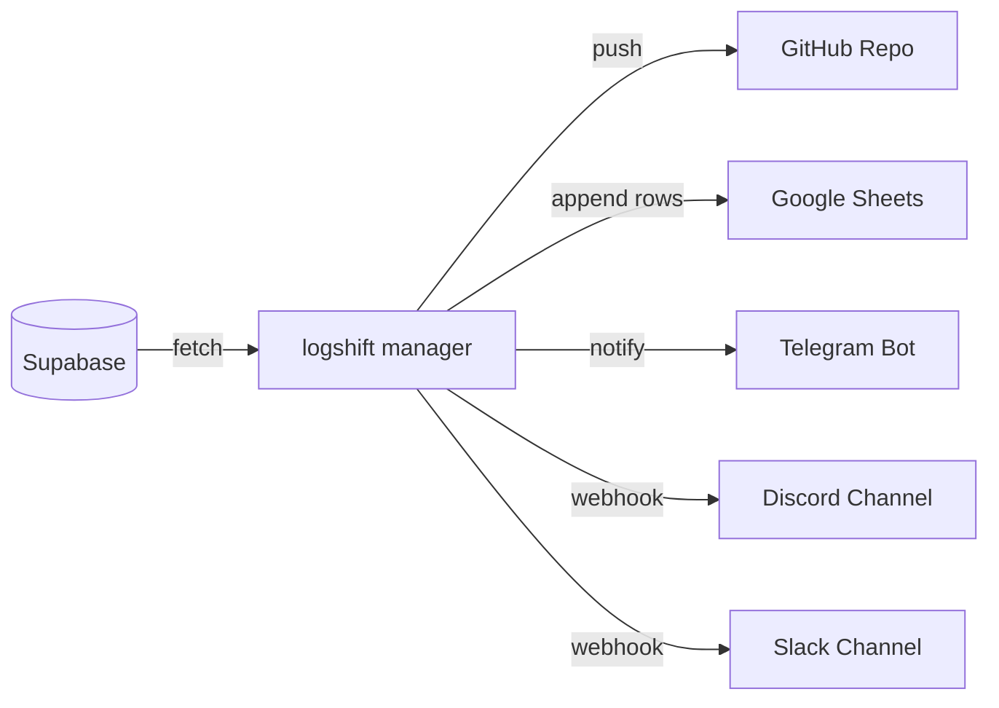

# Welcome to logshift

**logshift** (formerly logport) is a modular, multi-channel log archiving and transport SDK. It is designed to pull log entries from source databases (e.g. Supabase) and ship them asynchronously to various targets like GitHub, Google Sheets, Telegram, and Discord Webhooks.

## Core Goals
- **Retention Management:** Save money and retain history by shipping logs off database tables onto cheaper storage like GitHub repositories or Google Sheets.
- **Immediate Alerting:** Route critical error messages to notification channels (Telegram, Discord, Slack) instantly.
- **Clean Extensibility:** Add new communication adapters by simply implementing a standard subclass interface.

Explore the navigation sidebar to learn more about the Architecture and CLI usage.
